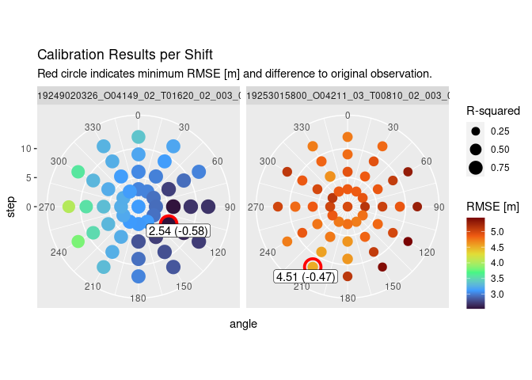
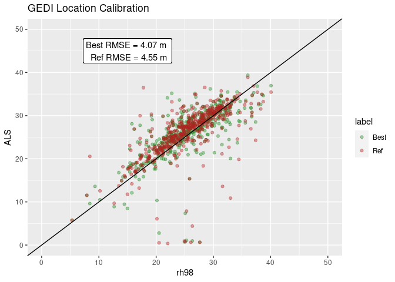

# GEDIcalibratoR

The goal of GEDIcalibratoR is to facilitate location calibration for
GEDI. It makes downloading tiles of ALS, DEM, and DSM data easy and
evaluates possible spatial shifts on user-defined calibration grids.
The best suitable shift can then be applied to the original data and may
improve statistical models and following analyses. GEDIcalibratoR also
provides functions to visualize calibration effects.

## Installation

You can install the development version of GEDIcalibratoR from
[GitHub](https://github.com/) with:

``` r
devtools::install_github("joheisig/GEDIcalibratoR")
```

## Development Goals

The package is currently usable. GEDI data can be calibrated using
digital surface and elevation models. More functionality shall be added
in the future, e.g.:

-   support of more complex calibration variables derived from ALS point
    clouds
-   more criteria to select the best shift (besides RMSE)
-   more and more flexible plotting options

## Example

``` r
library(GEDIcalibratoR)
library(sf)
```

    ## Linking to GEOS 3.10.2, GDAL 3.4.1, PROJ 8.2.1; sf_use_s2() is TRUE

``` r
grid_ext = system.file("demodata/grid_ext.rds", package = "GEDIcalibratoR") |> readRDS()
shifts = shift_stats(grid_ext)
head(shifts)
```

    ## Simple feature collection with 6 features and 8 fields
    ## Geometry type: MULTIPOINT
    ## Dimension:     XY
    ## Bounding box:  xmin: 245937.5 ymin: 5678698 xmax: 441963.1 ymax: 5701985
    ## Projected CRS: ETRS89 / UTM zone 33N
    ## # A tibble: 6 × 9
    ##   file                            step angle     n mean_diff sd_diff  rmse    r2
    ##   <chr>                          <dbl> <dbl> <int>     <dbl>   <dbl> <dbl> <dbl>
    ## 1 GEDI02_A_2019249020326_O04149…     0     0   114      2.18    3.08  3.12 0.775
    ## 2 GEDI02_A_2019249020326_O04149…     3     0   115      2.16    2.95  3.03 0.793
    ## 3 GEDI02_A_2019249020326_O04149…     3    30   114      2.18    2.95  3.03 0.793
    ## 4 GEDI02_A_2019249020326_O04149…     3    60   114      2.10    2.89  2.95 0.800
    ## 5 GEDI02_A_2019249020326_O04149…     3    90   113      2.09    2.88  2.93 0.803
    ## 6 GEDI02_A_2019249020326_O04149…     3   120   114      2.10    2.90  2.95 0.799
    ## # … with 1 more variable: geometry <MULTIPOINT [m]>

``` r
plot_shift_stats(shifts)
```

<!-- -->

``` r
bs = get_best_shift(grid_ext, shifts)
ns = get_no_shift(grid_ext, shifts)
plot_calibration(bs, ns, label = c("Best","Ref"), color = c("forestgreen", "firebrick"))
```

<!-- -->
